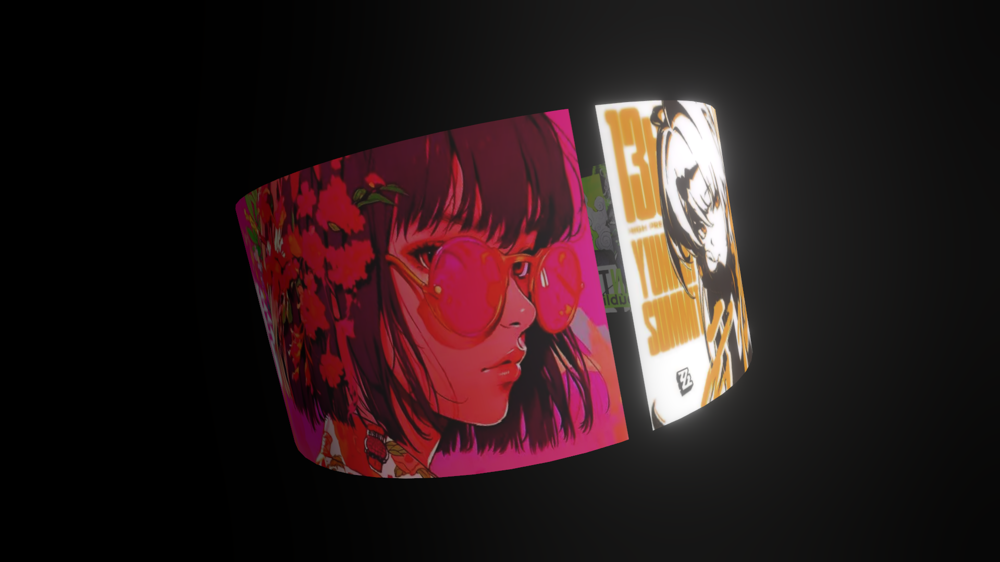

# Cylinder Image Visualizer

**A sleek 3D cylinder image visualizer** built with **React Three Fiber** and **Postprocessing**, featuring a textured rotating cylinder rendered with high geometry detail and wrapped in a glowing **Bloom** effect. Utilizes a full-screen WebGL canvas, ambient and directional lighting, and an immersive black background — delivering a smooth, cinematic visual experience in a minimalistic interface.


[](https://cylinder-img-visualizer.vercel.app/)

---

## ✨ Features

* 🌀 **Rotating Textured Cylinder** with seamless motion using `useFrame`, creating a smooth and continuous visual loop
* 🖼️ **High-Fidelity Texture Mapping** applied via `useTexture` and rendered on a double-sided cylinder for immersive visuals
* 💡 **Realistic Lighting Setup** combining soft ambient light and a powerful directional light to enhance depth and dimension
* 🌟 **Bloom Postprocessing Effect** using `@react-three/postprocessing` to add cinematic glow and emphasize highlights
* 🧱 **High-Detail Geometry** with 60 radial and height segments for ultra-smooth cylindrical surface rendering
* 🖥️ **Responsive Fullscreen Canvas** ensuring consistent visual quality across screen sizes with a minimalist black background
* ⚙️ **Modular Structure** with clean separation between the canvas setup (`App.jsx`) and scene logic (`Scene.jsx`)

---

## 🧠 How It Works

* Initializes a **Three.js canvas** using `@react-three/fiber`, filling the entire viewport with a responsive 3D scene
* Loads an external **texture map** (`tex2.webp`) via `useTexture` and applies it to a **cylinder mesh** with `meshStandardMaterial`
* Builds a **highly subdivided cylinder geometry** (`60x60`) to ensure smooth surface curves and detail fidelity
* Uses `useRef` and `useFrame` to **rotate the cylinder** continuously over time on the Y-axis, creating fluid motion
* Sets up **basic lighting** with ambient and directional lights to illuminate the scene naturally
* Adds a **Bloom effect** with `EffectComposer` and `Bloom`, enhancing visual appeal by highlighting bright areas with a soft glow
* Configures the material to be **double-sided and transparent**, allowing both interior and exterior texture visibility
* Wraps the mesh in a rotated parent `group` to fine-tune the initial viewing angle

---

## 🛠️ Built With

* [React Three Fiber](https://docs.pmnd.rs/react-three-fiber) – React renderer for Three.js, enabling a declarative 3D scene setup
* [Three.js](https://threejs.org/) – Core 3D engine for geometry, lighting, materials, and scene graph
* [@react-three/drei](https://github.com/pmndrs/drei) – Useful R3F helpers like `useTexture` and built-in abstractions
* [@react-three/postprocessing](https://github.com/pmndrs/postprocessing) – Adds cinematic effects like **Bloom** using `EffectComposer`
* [TailwindCSS](https://tailwindcss.com/) – Utility-first CSS framework for full-viewport layout and styling
* [CylinderGeometry](https://threejs.org/docs/#api/en/geometries/CylinderGeometry) – High-detail mesh for rendering the textured rotating surface
* [PerspectiveCamera](https://threejs.org/docs/#api/en/cameras/PerspectiveCamera) – For depth-accurate 3D perspective
* [meshStandardMaterial](https://threejs.org/docs/#api/en/materials/MeshStandardMaterial) – Physically-based material with texture support and realistic lighting response

---

## Clone the repo

```bash
git clone https://github.com/its-riki-dev/gradient-cube.git

# Install dependencies
npm install

# Start the development server
npm run dev

# Build for production
npm run build

# Preview production build
npm run preview
```

---

## 📄 License

- This project is licensed under the MIT License.
